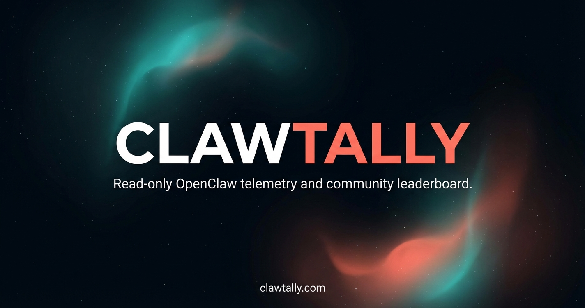

# Clawtally



Clawtally is a read-only telemetry dashboard for OpenClaw. It connects to a local gateway, visualizes usage, and can share anonymized snapshots to a public leaderboard.

## Highlights

- Read-only by design. No commands, no tool invocation, no file writes.
- Local-first connection via a lightweight connector.
- Clear usage breakdowns across tokens, costs, models, tools, cache, and errors.
- Optional community leaderboard and shared profiles.

## Quick Start

1. Install dependencies:

```bash
npm install
```

2. Run the app:

```bash
npm run dev
```

3. Run the local connector in a second terminal:

```bash
npm run connector
```

Open `http://localhost:3000`.

## Safety

Clawtally only reads usage telemetry to render analytics. It does not execute tasks, invoke tools, write files, or modify OpenClaw state.

## License

MIT. See `LICENSE`.
